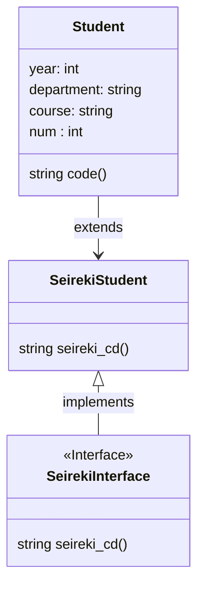

```mermaid
classDiagram
    Student
    class Student{
        year: int
        department: string
        course: string        
        num : int
        string code()
    }
```

```mermaid
classDiagram
    Student --> SeirekiStudent : extends
    SeirekiStudent <|-- SeirekiInterface : implements
    SeirekiStudent
    class Student{
        year: int
        department: string
        course: string               
        num : int
        string code()
    }
    class SeirekiStudent{
        string seireki_cd()
    }
    class SeirekiInterface {
        <<Interface>>
        string seireki_cd()
    }
```